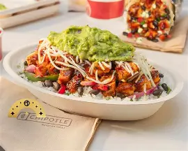

# Food Delivery App - Code Explanation

This is a simple Food Delivery App with restaurant listings, ordering functionality, and responsive styling.

---

## 1. HTML (index.html)

```
html
<!DOCTYPE html>
<html lang="en">
<head>
    <meta charset="UTF-8">
    <meta name="viewport" content="width=device-width, initial-scale=1.0">
    <link rel="stylesheet" href="styles.css">
    <title>Food Delivery App</title>
</head>
```
**Notes:**
- `<!DOCTYPE html>` - Declares the document type as HTML5
- `<html lang="en">` - Root element with English language attribute
- `<meta charset="UTF-8">` - Sets character encoding to UTF-8
- `<meta name="viewport" content="width=device-width, initial-scale=1.0">` - Enables responsive design for mobile devices
- `<link rel="stylesheet" href="styles.css">` - Links external CSS file for styling

---

```
html
<body>
    <header>
        <h1>Food Delivery App</h1>
        <button onclick="goHome()">home</button>
        <button>menu</button>
        <button>contact</button>
    </header>
```
**Notes:**
- `<header>` - Contains the app title and navigation buttons
- `<h1>` - Main heading for the app
- Navigation buttons with onclick handlers (though goHome() is defined in JS but not shown in script.js)

---

```
html
    <main>
        <section id="restaurant-list">
            <h2>Restaurants</h2>
            <ul>
                <li>
                    
                    <p class="price">$12.99</p>
                    <h3>Italian Bistro</h3>
                    <p>Address: 123 Pasta St</p>
                    <button onclick="orderFood('Italian Bistro')">Order Now</button>
                </li>
```
**Notes:**
- `<section id="restaurant-list">` - Container for displaying all restaurants
- `<ul>` and `<li>` - Unordered list for restaurant items
- Each `<li>` represents a restaurant card with:
  - Image (``) - Restaurant photo with alt text for accessibility
  - Price (`<p class="price">`) - Price of orders
  - Name (`<h3>`) - Restaurant name
  - Address - Restaurant location
  - Order button with onclick handler passing restaurant name

---

```
html
        <section id="order-form" style="display:none;">
            <h2>Order Food</h2>
            <form id="form">
                <label for="restaurant">Restaurant:</label>
                <input type="text" id="restaurant" readonly>
                <label for="items">Items:</label>
                <input type="text" id="items" placeholder="Enter items (e.g., Pizza, Salad)">
                <button type="submit">Submit Order</button>
            </form>
            <button onclick="cancelOrder()">Cancel</button>
        </section>
    </main>
```
**Notes:**
- `<section id="order-form" style="display:none;">` - Hidden by default, shown when ordering
- `<form id="form">` - Form for order submission
- `<label for="restaurant">` - Label linked to input via for/id attributes
- `<input type="text" id="restaurant" readonly>` - Pre-filled restaurant name (read-only)
- `<input type="text" id="items">` - User input for order items
- `<button type="submit">` - Submits the form
- Cancel button resets the form and returns to restaurant list

---

```
html
    <script src="script.js"></script>
</body>
</html>
```
**Notes:**
- External JavaScript file inclusion at the end of body for better loading performance

---

## 2. JavaScript (script.js)

```
javascript
function orderFood(restaurant) {
    document.getElementById('restaurant').value = restaurant;
    document.getElementById('restaurant-list').style.display = 'none';
    document.getElementById('order-form').style.display = 'block';
}
```
**Notes:**
- `orderFood(restaurant)` - Function triggered when clicking "Order Now" button
- Sets the restaurant input value to the selected restaurant
- Hides the restaurant list (`display: 'none'`)
- Shows the order form (`display: 'block'`)
- This creates a smooth transition between views

---

```
javascript
document.getElementById('form').addEventListener('submit', function(event) {
    event.preventDefault();
    const restaurant = document.getElementById('restaurant').value;
    const items = document.getElementById('items').value;

    // Here you would typically send this data to your server
    alert(`Order placed for ${items} at ${restaurant}`);
    
    // Reset and go back to restaurant list
    document.getElementById('form').reset();
    document.getElementById('restaurant-list').style.display = 'block';
    document.getElementById('order-form').style.display = 'none';
});
```
**Notes:**
- Event listener for form submission
- `event.preventDefault()` - Prevents default form submission (page reload)
- Gets values from input fields using `getElementById()`
- Shows alert confirmation with order details
- `form.reset()` - Clears all input fields
- Returns user to restaurant list after order

---

```
javascript
function cancelOrder() {
    document.getElementById('form').reset();
    document.getElementById('restaurant-list').style.display = 'block';
    document.getElementById('order-form').style.display = 'none';
}
```
**Notes:**
- `cancelOrder()` - Cancels the current order process
- Resets the form (clears inputs)
- Shows restaurant list again
- Hides order form

---

## 3. CSS (styles.css)

```
css
body {
    font-family: Arial, sans-serif;
    margin: 0;
    padding: 0;
    background-color: #f4f4f4;
}
```
**Notes:**
- Sets default font to Arial (falls back to sans-serif)
- Removes default margin and padding
- Sets light gray background color for the entire page

---

```
css
header {
    background: linear-gradient(90deg, #ff69b4, #ffeb3b);
    color: #fff;
    padding: 10px 0;
    text-align: center;
}
```
**Notes:**
- Creates colorful gradient background (pink to yellow)
- White text color
- Vertical padding of 10px
- Centers all header content

---

```
css
header button {
    float: right;
    margin-right: 10px;
}
```
**Notes:**
- Floats header buttons to the right side
- Adds right margin for spacing

---

```
css
main {
    padding: 20px;
}
```
**Notes:**
- Adds 20px padding around main content area

---

```
css
ul {
    list-style-type: none;
    padding: 0;
}
li {
    background: #fff;
    margin: 10px 0;
    padding: 15px;
    border-radius: 5px;
    box-shadow: 0 2px 5px rgba(0, 0, 0, 0.1);
    display: flex;
    flex-direction: column;
    align-items: flex-start;
}
```
**Notes:**
- Removes default list bullets
- Each list item has:
  - White background
  - 10px vertical margin
  - 15px padding
  - Rounded corners (5px border-radius)
  - Subtle shadow for depth
  - Flexbox layout with column direction
  - Left-aligned items

---

```
css
li button {
    align-self: flex-end;
    margin-top: 10px;
}
```
**Notes:**
- Positions order buttons to the right side of each restaurant card
- Adds top margin for spacing

---

```css
button {
    background: #28a745;
    color: white;
    border: none;
    padding: 15px;
    cursor: pointer;
    border-radius: 9px;
}
button:hover {
    background: #218838;
}
```
**Notes:**
- Green background (#28a745) for all buttons
- White text
- No border
- 15px padding
- Pointer cursor on hover
- Rounded corners (9px)
- Darker green on hover for visual feedback

---

```
css
#order-form button {
    float: right;
    margin-left: 10px;
}
```
**Notes:**
- Floats order form buttons to the right
- Adds left margin for spacing between buttons

---

```
css
footer {
    text-align: center;
    padding: 20px;
    background: #333;
    color: #fff;
    position: absolute;
    width: 100%;
    bottom: 0;
}
```
**Notes:**
- Footer styling (though footer element is not in HTML)
- Centered text
- Dark background (#333)
- White text
- Positioned absolutely at the bottom of the page
- Full width

---

## Summary

This is a simple, functional food delivery web app that demonstrates:
- **HTML**: Structure with semantic elements, forms, and lists
- **CSS**: Styling with gradients, flexbox, and responsive design basics
- **JavaScript**: DOM manipulation, event handling, and form processing

